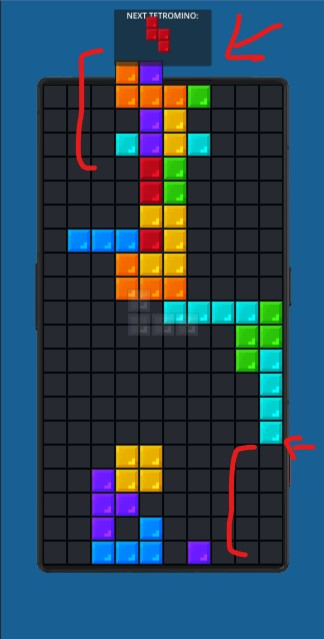
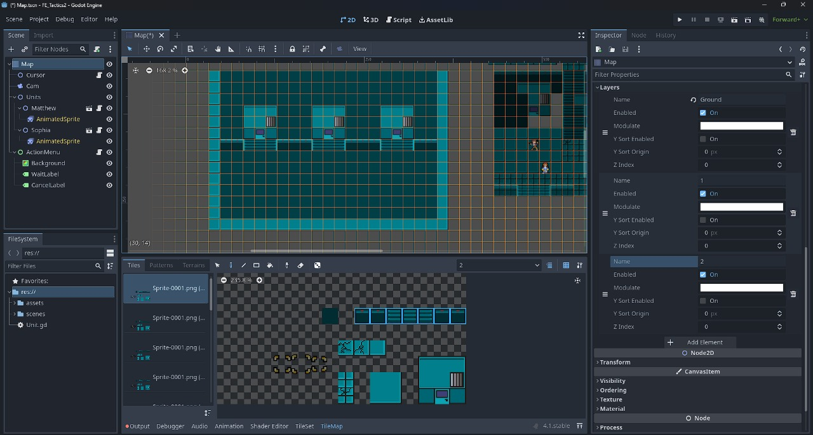
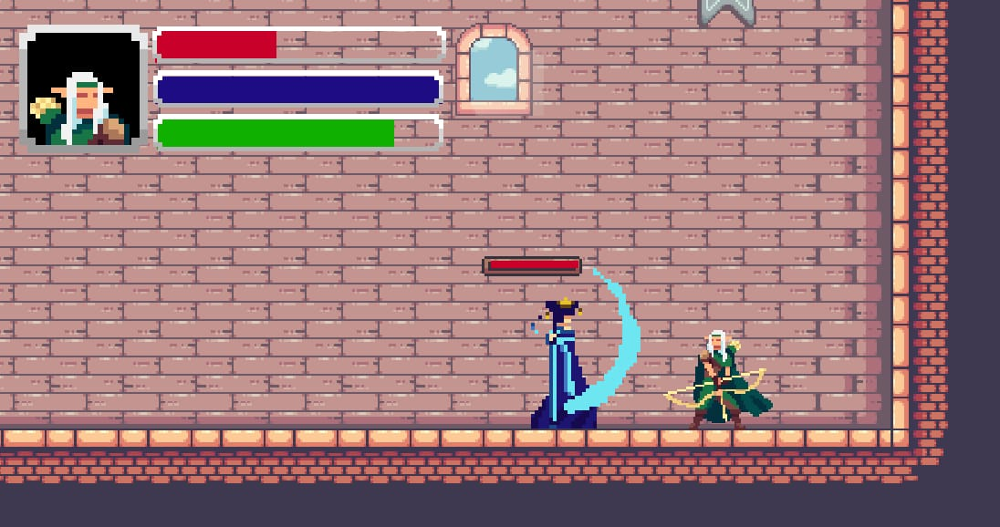
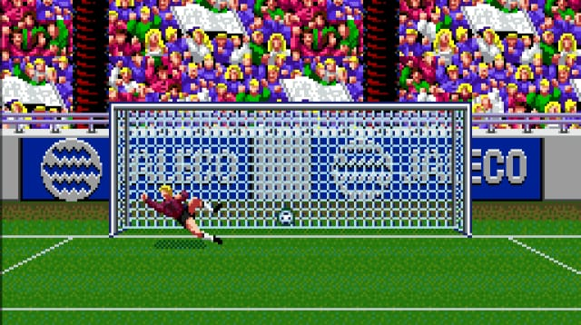
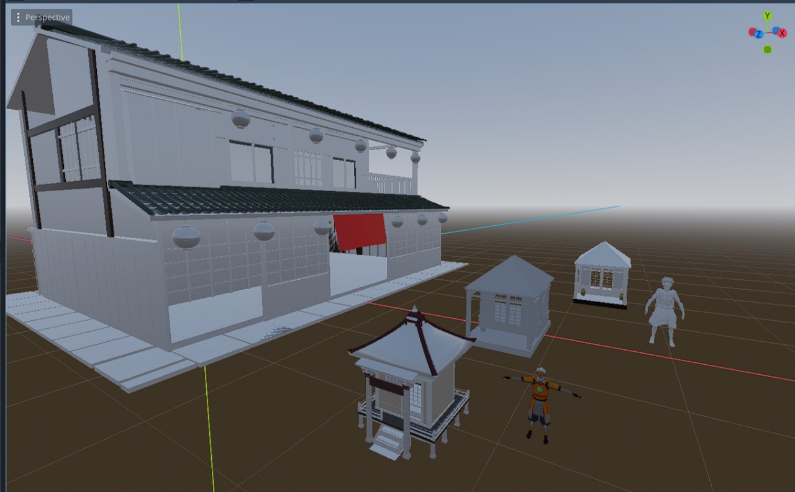

# 🎮 Asad — Godot 2D Game Developer Portfolio

  
  
  

5+ years building 2D games in **Godot Engine** as a freelance developer on Fiverr, with 200+ completed projects — gameplay systems, tactics/RPG combat, arcade minigames, UI implementation, and full game builds from scratch or from client specs.

**Tech:** GDScript · C# · TileMaps & TileSets · AnimatedSprite/state machines · Godot UI (Control nodes) · Mobile touch input · WebGL/Android export

📫 Available for freelance work — [Fiverr](https://www.fiverr.com/) · See profile: [@AsadCreations](https://github.com/AsadCreations)

---

## 📂 Projects

### 1. Tactics RPG Combat System
Fire Emblem–style grid-based tactics game — turn-based unit movement, action menus (attack/wait/cancel), TileMap-driven combat grid, multiple playable units with individual animated sprites.

**Tech:** Godot 4.1, GDScript, TileMap layers, custom Unit resource script

---

### 2. Pixel Art RPG Battle System
Side-view turn-based battle scene with a full combat UI — HP, MP, and stamina bars, portrait frame, spell-cast animation (ranged arc effect), and enemy AI turn.

**Tech:** Godot, GDScript, pixel-art animation, custom UI bars

---

### 3. SkyArk — Mobile Exploration Game
Atmospheric exploration game across floating islands, built for mobile with on-screen virtual joystick and touch controls. Custom lighting/color-grading for a dreamlike sky palette.

**Tech:** Godot, GDScript, mobile touch input (virtual joystick), parallax/atmosphere shaders

*(demo video coming soon)*

---

### 4. Atmospheric Side-Scroller
Minimalist monochrome side-scrolling platformer — a torch-carrying character exploring a dark cave environment, with soft glow lighting effects and mood-driven pixel art.

**Tech:** Godot, GDScript, CanvasModulate/lighting, custom pixel-art character animation

*(demo video coming soon)*

---

### 5. Foss the Alien (SpinLab)
Sci-fi 2D platformer/adventure title — contributed gameplay and item-system scripting (`Items.gd`), scene transitions, and loading-screen logic.

**Tech:** Godot, GDScript, item/inventory system, scene transition manager

*(demo video coming soon)*

---

### 6. TetrisDuel — Multiplayer Tetris + Web Front-End
Classic Tetris gameplay (full tetromino set, next-piece preview, line-clear logic) paired with a complete web front-end — landing page, login/signup flow, and leaderboard.

**Tech:** Godot (2D/3D toggle build), GDScript, HTML/CSS front-end, leaderboard system

---

### 7. Full Chess Implementation
Complete, rules-accurate chess game — legal move highlighting, full piece set, turn-based play, built for desktop.

**Tech:** Godot, GDScript, move-validation logic, board-state management

---

### 8. Horror-Themed Blackjack Minigame
Stylized horror blackjack/21 minigame — hand-drawn horror character art, dual health-bar system (hearts), hit/stand/optimal-move options, and a tense card-table atmosphere.

**Tech:** Godot, GDScript, custom card-game logic, hand-drawn UI art integration

---

### 9. Retro Arcade Football (Penalty Shootout)
Classic arcade-style penalty-kick game inspired by 90s sports titles — goalkeeper dive animation, crowd sprite backdrop, and pixel-perfect retro presentation.

**Tech:** Godot, GDScript, sprite animation, retro pixel-art rendering

---

### 10. Character Art & Modular Rigging Sheet
Modular character asset sheet (hawk-themed warrior) — separated head, hair, armor, wings, and limb pieces, built for swappable equipment/customization systems in-engine.

**Tech:** 2D character art, modular part-based rigging for in-game customization

---

### 11. 3D Environment Test (Godot 3D)
Low-poly Japanese village environment test — buildings, shrine props, and character placeholders, built to explore Godot's 3D workflow alongside my primary 2D work.

**Tech:** Godot 3D, low-poly modeling/import pipeline

---

## 📫 Contact

- Fiverr: *(https://www.fiverr.com/asad_services4u/develop-2d-game-design-using-godot-engine-and-renpy-engine)*
- Email: *(asad8service4u@gmail.com)*
- GitHub: [@AsadCreations](https://github.com/AsadCreations)
